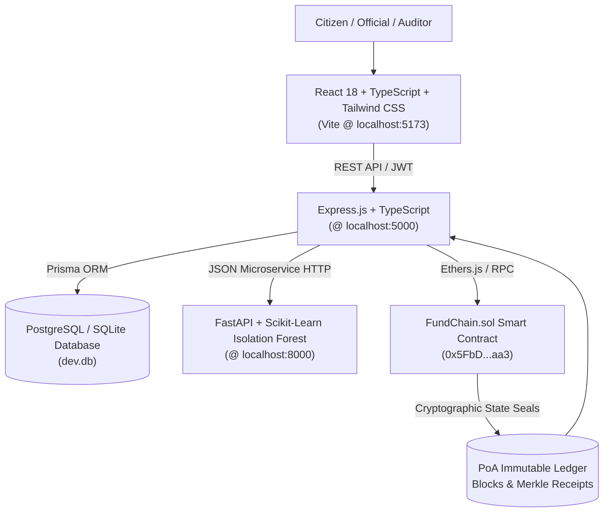

# FundChain 🏛️⛓️
**Blockchain-Based Public Fund Tracking & Transparency System**  
*"Track Every Rupee. Verify Every Record."*

> **ACADEMIC DEMONSTRATION DATASET**  
> Developed for Final-Year B.E. (Bachelor of Engineering) Major Project.  
> Includes realistic public infrastructure schemes, simulated Proof-of-Authority ledger events, and Scikit-Learn anomaly detection.

---

## 🌟 Executive Summary

**FundChain** is an ultra-modern GovTech + FinTech platform designed to eliminate leakages, delay-tactics, and phantom invoicing in public infrastructure procurement. Built on a tamper-evident blockchain verification layer paired with automated Machine Learning anomaly detection, FundChain ensures that every public rupee disbursed from state treasury to grassroot contractors is cryptographically sealed and publicly verifiable.

### The Core Flow
$$\text{Government} \longrightarrow \text{Department} \longrightarrow \text{Contractor} \longrightarrow \text{Project} \longrightarrow \text{Milestone} \longrightarrow \text{Fund Release} \longrightarrow \text{Expense} \longrightarrow \text{Blockchain} \longrightarrow \text{Citizen}$$

---

## 🚀 Live System URLs

| Service | Address | Description |
|---|---|---|
| **Web Application (Frontend)** | [http://localhost:5173](http://localhost:5173) | Modern React 18 + TypeScript + Tailwind UI |
| **REST API Server (Backend)** | [http://localhost:5000](http://localhost:5000) | Express.js + Prisma ORM + Ethers.js Sync |
| **AI Anomaly Microservice** | [http://localhost:8000](http://localhost:8000) | Python + FastAPI + Scikit-Learn Isolation Forest |
| **Smart Contract (PoA Ledger)** | `0x5FbDB2315678afecb367f032d93F642f64180aa3` | Solidity ^0.8.20 Multi-Role Escrow Contract |

---

## 🔑 1-Click Evaluation Roles & Personas

FundChain comes pre-equipped with a **1-Click Evaluation Switcher** accessible in the navigation bar and on the login page:

1. **Citizen (Public Access)**
   - No login or registration required.
   - Real-time search, multi-factor filtering, GIS OpenStreetMap navigation, and interactive 7-step *Follow the Money* visualization.
2. **Government Official (`gov@fundchain.gov.in`)**
   - Role: Principal Secretary (Finance) & Treasury Signer.
   - Capabilities: Macro budget allocation, departmental top-ups, milestone escrow tranche releases, and state-wide portfolio monitoring.
3. **Department Head (`dept.pwd@fundchain.gov.in`)**
   - Role: Chief Engineer, Public Works Department (PWD).
   - Capabilities: Propose new infrastructure projects, assign contractor tenders, verify on-site completion evidence, and approve milestones.
4. **Contractor (`contractor.apex@fundchain.com`)**
   - Role: Managing Director, Apex Infra Projects Pvt Ltd.
   - Capabilities: Inspect assigned projects, submit geotagged milestone completion proofs (with SHA-256 hashes), and record itemized vendor invoices.
5. **State Auditor (`auditor@fundchain.gov.in`)**
   - Role: Senior State Auditor (CAG).
   - Capabilities: Run system-wide ML batch scans across all 30 projects, inspect physical vs. financial disparities, verify document hashes on-chain, and resolve audit findings.

*Default password for all demo accounts:* `password123`

---

## 🛠️ Architecture & Technology Stack



### 1. Smart Contract (`blockchain/contracts/FundChain.sol`)
- **Solidity ^0.8.20** with OpenZeppelin reentrancy guard patterns.
- Multi-role access control (`onlyGovernment`, `onlyAuthorized`, `authorizedContractors`).
- Complete core functions: `createProject`, `allocateFunds`, `createMilestone`, `submitMilestoneEvidence`, `approveMilestone`, `releaseFunds`, `recordExpense`, `registerDocumentHash`.
- Off-chain storage architecture: Large files and inspection PDFs stay off-chain; cryptographic SHA-256 hashes and IPFS CIDs are sealed on-chain.

### 2. Machine Learning Anomaly Detection (`ai-service/`)
- **Python 3.12 + Scikit-Learn `IsolationForest` + FastAPI**.
- Multi-parameter feature vector: financial progress %, physical progress %, budget utilization ratio, expense-to-allocated ratio, and release frequency.
- Primary Disparity Check: Highlights projects where financial progress is significantly higher than reported physical progress.
- Strictly adheres to the neutral audit standard: **"Review Required — Financial progress is higher than reported physical progress."** Never describes an anomaly as proof of fraud.

### 3. Database & Sync (`server/prisma/schema.prisma`)
- Full relational schema: `User`, `Department`, `Contractor`, `Project`, `FundAllocation`, `Milestone`, `FundRelease`, `Expense`, `Document`, `BlockchainTransaction`, `Anomaly`, `AuditLog`.
- Seeds a realistic Academic Demonstration Dataset with **10 departments, 30 projects, 20 contractors, and 250+ on-chain transactions**.

### 4. GIS Infrastructure Mapping (`client/src/components/GISMap.tsx`)
- **React Leaflet + OpenStreetMap**.
- Pinned markers across Karnataka and national regions with status colors (Green = Completed, Blue = Ongoing, Amber = Review/Delayed).
- Sector filters: *Roads, Schools, Hospitals, Water, Infrastructure*.

---

## 🧪 Testing the End-to-End Governance Flow

You can test the complete lifecycle right in your browser at `http://localhost:5173`:

1. **Explore the Citizen Dashboard:**
   - Go to [http://localhost:5173/dashboard](http://localhost:5173/dashboard).
   - Filter by Sector (e.g. *Roads* or *Hospitals*).
   - Click **"Flow"** on any project to inspect the 7-step *Follow the Money* audit path.
2. **Inspect an Anomaly Indicator:**
   - Open project `FC-2026-PWD-002` (Kabini River Bridge Replacement).
   - Note the prominent amber alert:
     > **Review Required — Financial progress (78.5%) is higher than reported physical progress (35.0%).**
3. **Verify a Blockchain Transaction:**
   - Go to [http://localhost:5173/verify](http://localhost:5173/verify).
   - Click any recent transaction hash or enter a custom hash to see the tamper-proof ledger receipt.
4. **Execute an Administrative Action:**
   - Use the Role Switcher in the top navbar to switch to **Government Official**.
   - Navigate to the Government Desk and click **"Release Milestone Tranche"**.
   - Watch the transaction get mined, state updated, and ledger receipt generated in real time!
5. **Contractor Evidence Submission:**
   - Switch to **Contractor**.
   - Click **"Submit Milestone Proof"** to register a geotagged site certificate SHA-256 hash.
6. **Auditor ML Batch Scan:**
   - Switch to **Auditor**.
   - Click **"Run ML Batch Audit Across All 30 Projects"** to invoke the Python Isolation Forest model.

---

## 💻 Manual Commands & Restart Instructions

If you ever need to stop or restart the services:

### 1. Start AI Microservice
```powershell
cd C:\Users\Prajwal\.gemini\antigravity\scratch\fundchain\ai-service
python main.py
```

### 2. Start Backend API Server
```powershell
cd C:\Users\Prajwal\.gemini\antigravity\scratch\fundchain\server
npx tsx src/index.ts
```

### 3. Start Frontend Client
```powershell
cd C:\Users\Prajwal\.gemini\antigravity\scratch\fundchain\client
npm run dev
```

---

*Academic Major Project &bull; Bachelor of Engineering (B.E.) &bull; FundChain 2026*
